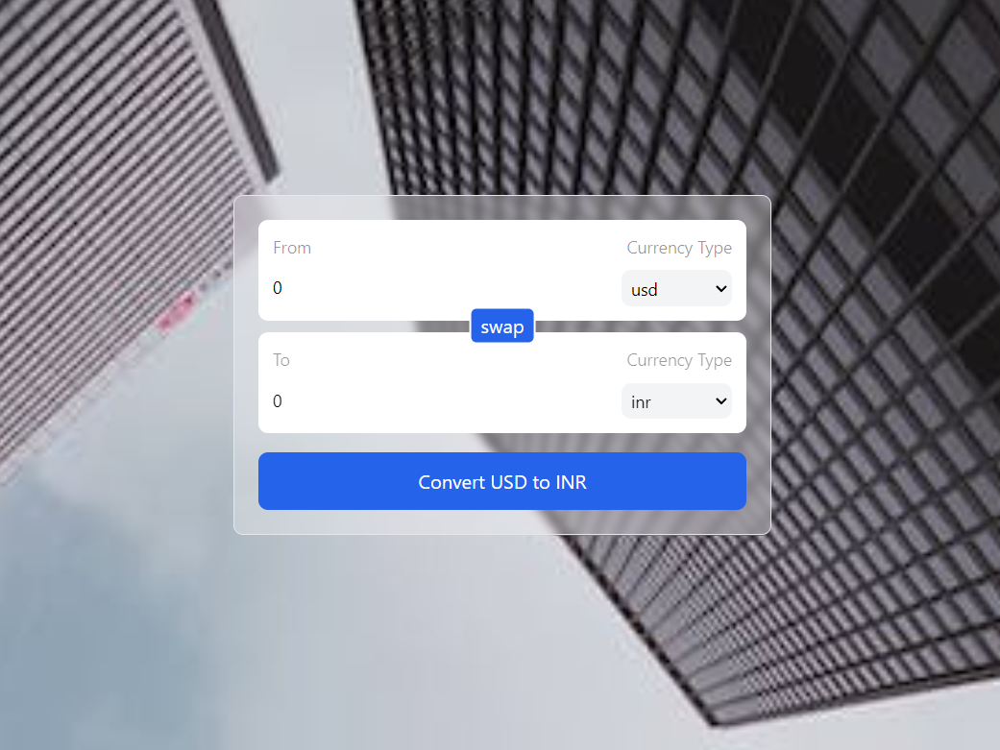
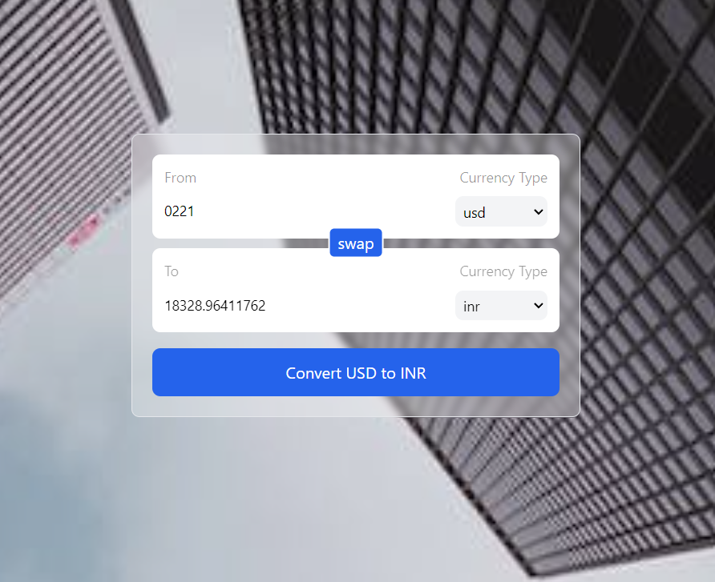

# Currency Converter with React


## Overview

This React-based Currency Converter project allows users to convert between different currencies. The application utilizes custom hooks for state management and performs API calls on the frontend to fetch the latest exchange rates.

## Features

- Convert between various currencies
- Real-time exchange rates using a third-party API
- Custom hooks for efficient state management

## Screenshots

<!-- Add screenshots of your application in action -->



## Installation

1. Clone the repository:

    ```bash
    git clone https://github.com/your-username/currency-converter.git
    cd currency-converter
    ```

2. Install dependencies:

    ```bash
    npm install
    ```

## Usage

1. Run the application:

    ```bash
    npm run dev
    ```

2. Open your browser and navigate to [http://localhost:3000](http://localhost:3000)

## Custom Hooks

The project makes use of the following custom hooks:

- **useCurrencyInfo**: Manages the state and logic for currency conversion.

## API Integration

The application fetches exchange rates from a public API. To configure the API endpoint or key, refer to the `src/api/config.js` file.

```javascript
// src/api/config.js

export const API_BASE_URL = 'https://cdn.jsdelivr.net/gh/fawazahmed0/currency-api@1/latest/currencies/${currency}.json';
export const API_KEY = 'your-api-key';
